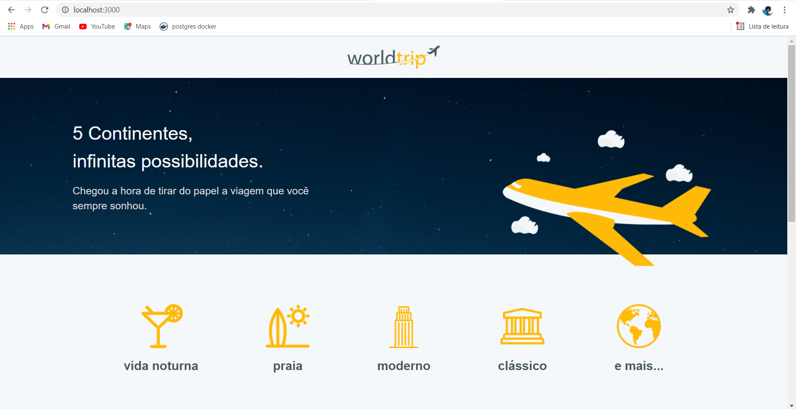
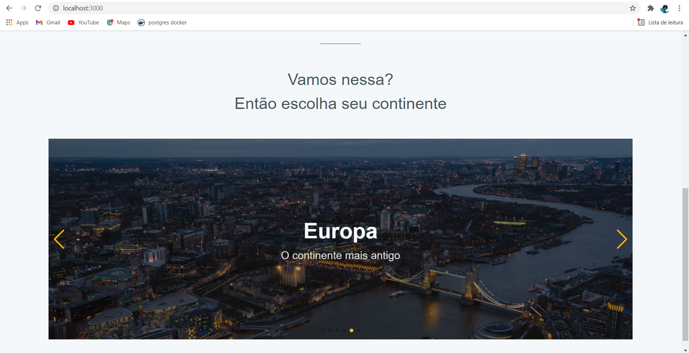
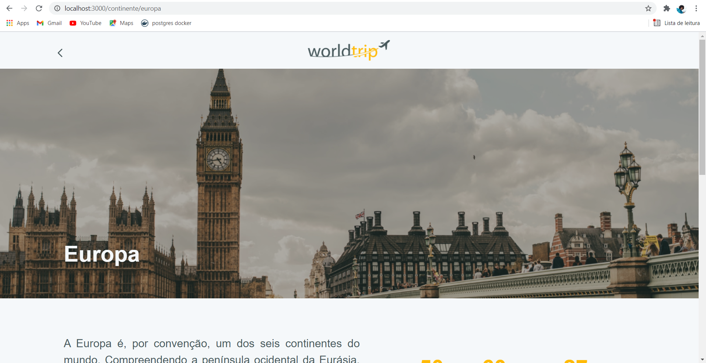
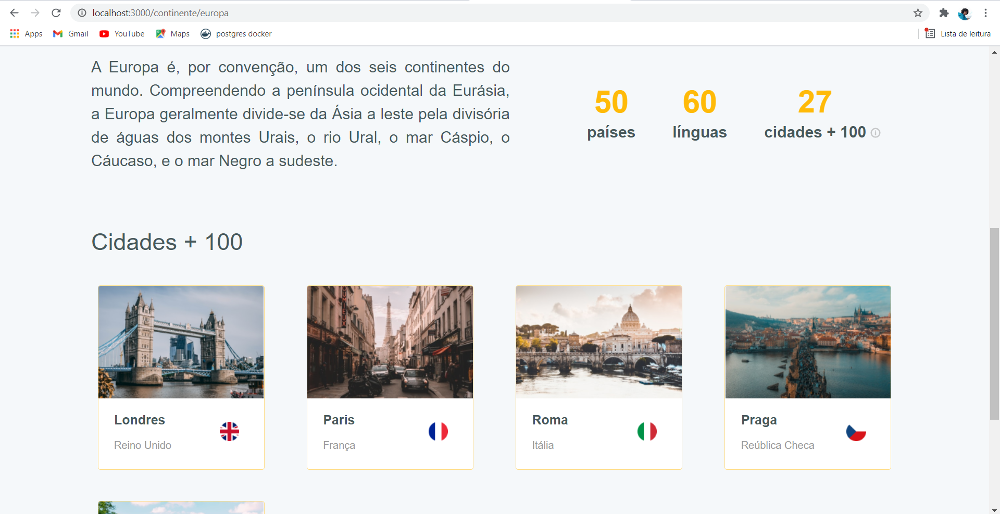
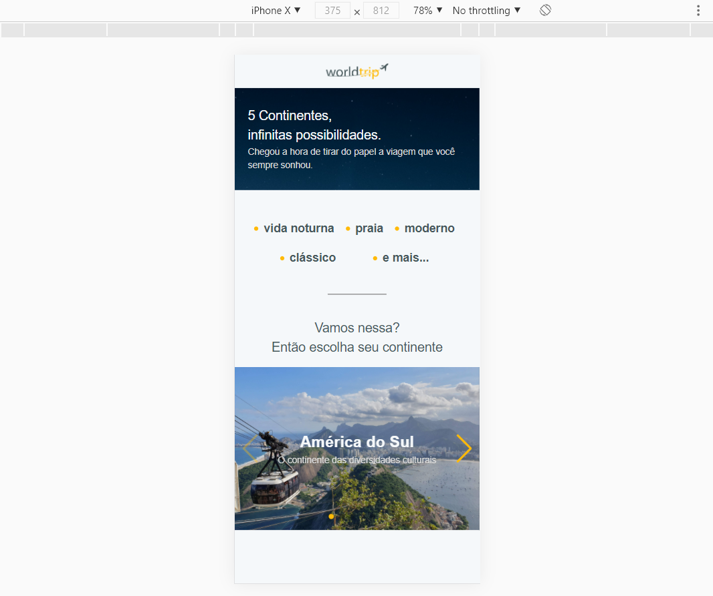
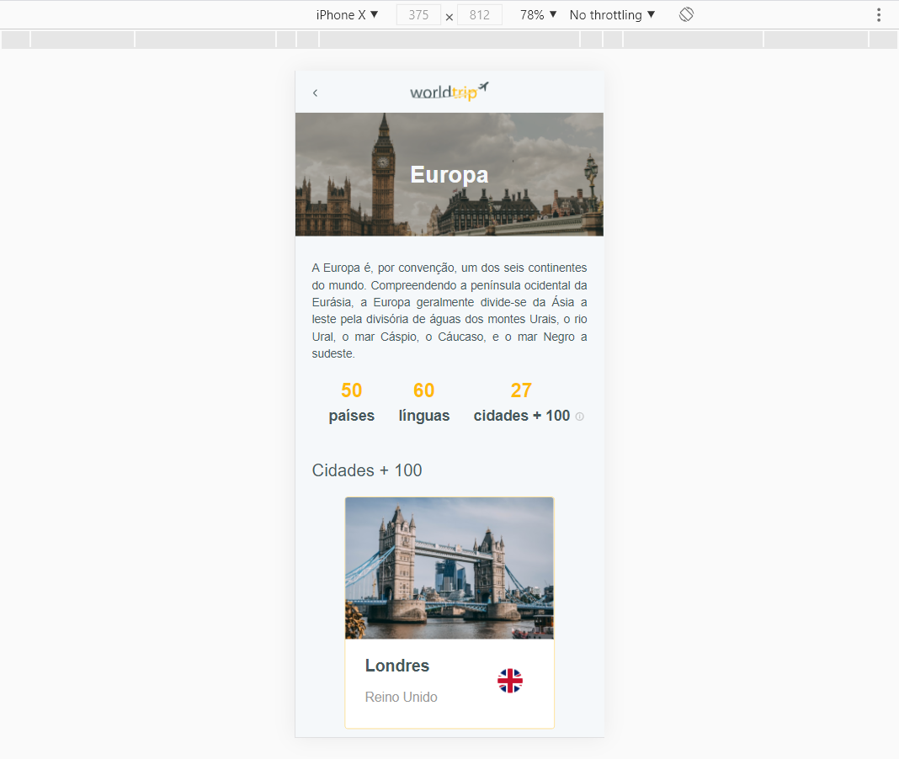
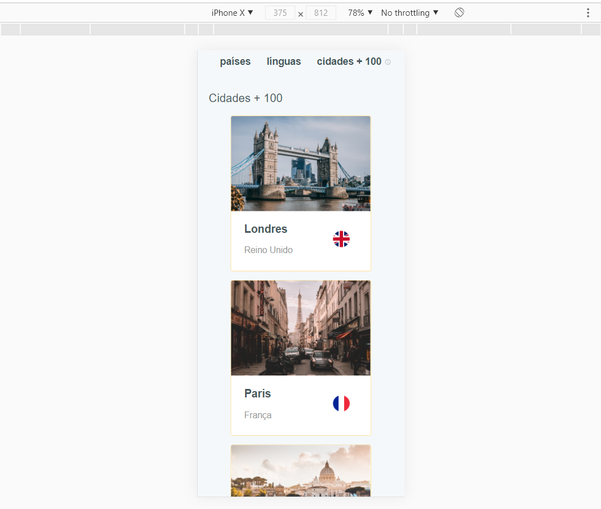

# worldtrip 🌎
### 👩🏾‍🚀 Journey Ignite Rocketseat Module 04 Challenge 01 - Create an web application with Chakra UI, ReactJS and Next.js

In this challenge I created an application using ReactJS together with Next.js.
In it I had two main objectives.
The first was to develop the entire interface based on the Chakra UI. The second was to work on the responsive layout of the application.

### Video:
 
 
### Images:

 

 

 

 

